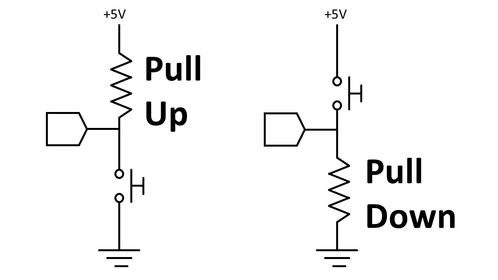
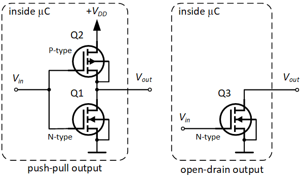
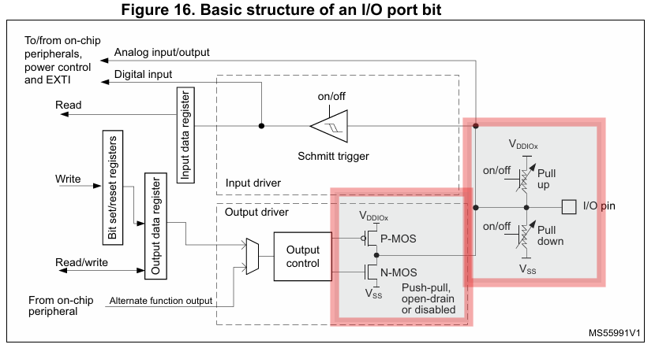

### Blink 202.        
[Demo](https://youtu.be/tKnZ2aMsRHI)

A program to toggle an LED based on reading the button state.

| Button      | LED |
| ----------- | --- |
| Pressed     | OFF |
| Not Pressed | ON  |

The button is connected to a Pull Up GPIO pin.     
When untouched, the pin reads logic HIGH.    
When pressed, the pin reads logic LOW.         

### Connections

   Pin D9 (PA 9) - GPIO Input Mode (Pull Up): Read button state    
   Pin D8 (PC 7) - GPIO Output Mode: Drive LED 

   
   
### Pull Up vs Pull Down   

   - These configurations are more relevant to input pins since output pins are usually driven by the microcontroller.             
   - **Pull Up:** Connects the pin to Vcc, so the pin is HIGH when on standby.        
   - **Pull Down:** Connects the pin to GND, so the pin is LOW when on standby. This configuration is vital for the input pin to prevent logic high (1) when the button is not pressed.      

### Open drain vs Push Pull 

   &emsp;These configurations are relevant to output pins used to actively drive the pins high and low.     

 #### Open Drain
   - Consists of an NMOS which is used to enable the _Low state_.        
   - The output pin can be in a logic low or disconnected state.    
   - When in the disconnected state, an external pull up resistor to VDD is used to create the _High State_.       
   - **Low State:** When gate voltage _greater_ than threshold voltage is supplied to the NMOS, it effectively creates a short to ground (path of least resistance) as the pull up resistor provides high impedence to VDD.            
   - **High State:** When the NMOS is off, the line is pulled up to VDD.     
   - The presence of the pull up resistor makes switching much slower. For applications that require fast switching between high and low states, this configuration is not preferred.
   
 #### Push Pull

   - This configuration also uses an NMOS to create the _Low State_.       
   - However, unlike the open drain configuration which uses a resistor, a PMOS is used to create the _High State_.                  
   - **Low State:** When gate voltage _greater_ than threshold voltage is supplied to the NMOS, it effectively creates a short to ground since it is the path of least resistance (PMOS is open).           
   - **High State:** When gate voltage _lesser_ than threshold voltage is supplied to the PMOS, it creates a connection to VDD (NMOS is open).    
   - This is the preferred configuration for applications that have to switch between states quickly.    

### GPIO Pin structure

This image shows the structure of an I/O pin with the discussed configuration.
    
### Registers 
   _x_ - A, C    
   
   - _**RCC_AHBENR**_ (AHB peripheral clock enable)     
      - Set bit 19 & 17 HIGH to enable peripheral clock for ports A & C.    
   
   
   - **_GPIOx_MODER_** (GPIO Mode)      
      - Set Bits [19:18] to 01 to enable GPIO output mode for PA 9.        
      - Reset Bits [15:14] to 00 to enable input mode for PC 7.

   - **_GPIOx_OTYPER_** (Output Type)            
      - Set Bit 9 for output type push-pull.    

   - **_GPIOx_PUPDR_** (Pull up/Pull down Register)        
      - Enable pull up for PA 9 by setting Bits [19:18] as 01.  
      - Enable pull down for PC 7 (input) by setting Bits [15:14] as 10.   

   - **_GPIOx_IDR_** (Input Data Register)       
      - Use this register to check whether button is pressed (HIGH) to switch off the LED.      

   - **_GPIOx_ODR_** (Output Data Register)      
      - Set this register to output HIGH signal on the PA 9 pin.          
  
   - **_GPIOx_BSRR_** (Bit Set/Reset Register)      
      - Set Bit 9 to set the corresponding port A ORD register as HIGH.     
      - Set Bit 25 to reset the corresponding port A ORD register as LOW.   
	     
### Code overview                  
               
   &emsp;gpioInit Function:                
   &emsp;&emsp;Configure the relevant registers.          
   
   &emsp;button Function:                           
   &emsp;&emsp;Check whether the button is pressed.             
   &emsp;&emsp;If true, then LED is turned OFF.         
   &emsp;&emsp;Else, LED is turned ON.                  
   
### References          
- [stm32 - Difference between open drain and push-pull modes - Electrical Engineering Stack Exchange](https://electronics.stackexchange.com/questions/620150/difference-between-open-drain-and-push-pull-modes) 
- [STM32F0x1/STM32F0x2/STM32F0x8 advanced Arm-based 32-bit MCUs - Reference manual](https://www.st.com/resource/en/reference_manual/rm0091-stm32f0x1stm32f0x2stm32f0x8-advanced-armbased-32bit-mcus-stmicroelectronics.pdf)
- [Tinkercad + Arduino Lesson 6: Pull-up and Pull-down Resistors - YouTube](https://www.youtube.com/watch?v=aPVMKyZpaPA)
